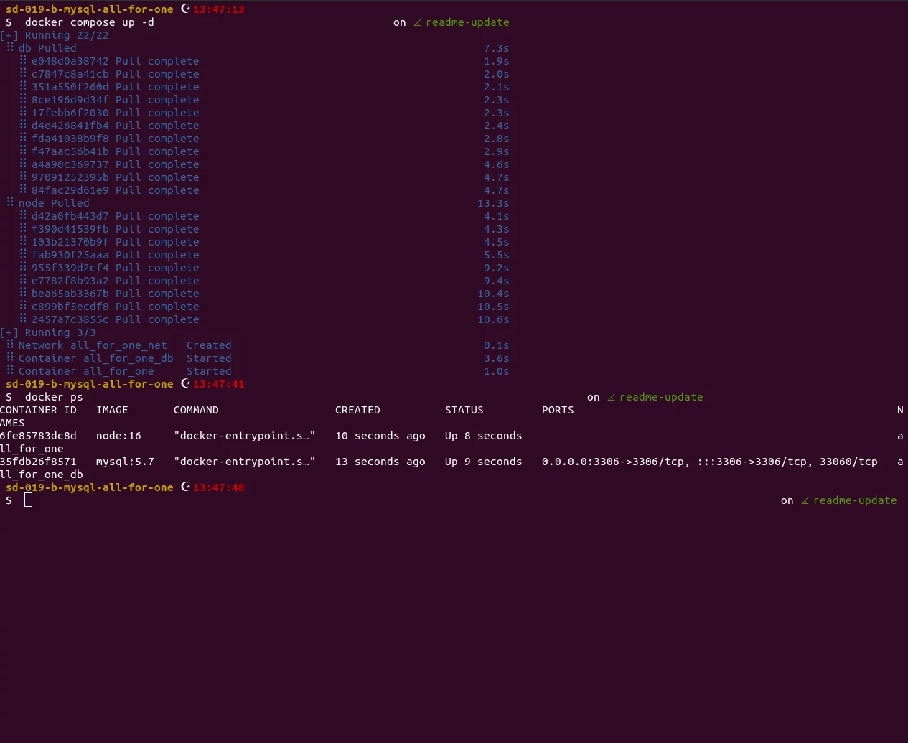
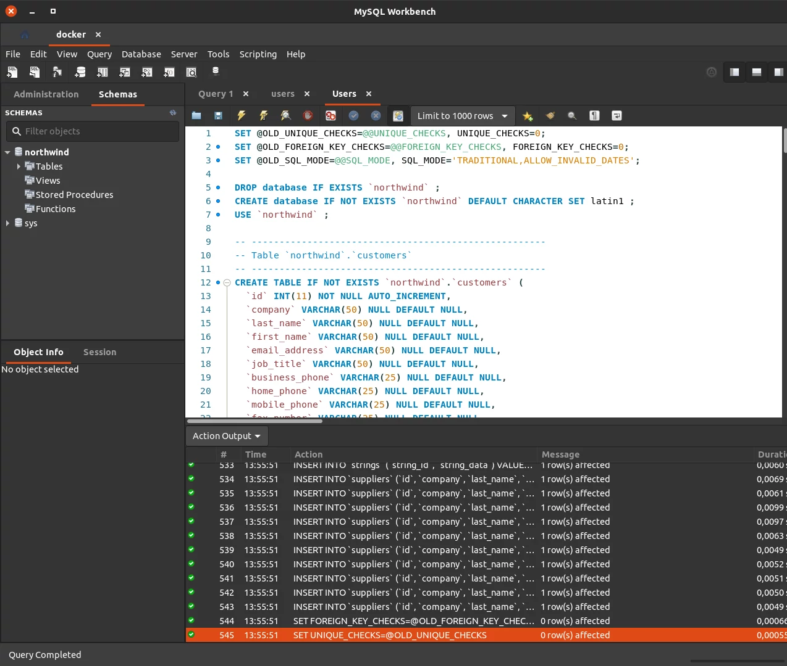

# Sobre

## Seção: `Introdução à SQL`

- SQL (Structured Query Language) é a mais usada para criar, pesquisar, extrair e manipular dados em um banco relacional.
- Principal foco nessa seção foi aprender e se familiarizar com as buscas realizadas usando o workbench para ter uma melhor visibilidade do banco MySQL em um container docker.
#

  

>*Conteúdo sobre comandos usados para o buscas no mysql*
#
## Projeto: `All for One`

- Apesar de apontar como projeto para manter um padrão conforme do curso, foi uma prática SQL, criando um banco mysql em um container, por meio do workbench foi acessado esse banco e realizado [queries](https://github.com/davidrogger/trybe-mysql-all-for-one/tree/readme-update/queries) para localizar e filtrar informações no banco.

# Tecnologias e ferramentas usadas 🛠

# Desafios

- Mesmo absorvendo todo conteúdo do curso, não melhor forma de consolidar se não aplicando na prática, a atividade promoveu bem, queries necessários no dia a dia.

# Conclusão

- Assim como a seção anterior foi mais a receita do bolo, entender a sintaxe necessária para realizar a ação necessária na busca do banco.

  

    <strong>
      :newspaper_roll: Requisitos solicitados durante o desenvolvimento do projeto
    </strong>
  

 
### Requisitos
*Nome* | *Avaliação*
--- | :---:
1 - Exiba apenas os nomes dos produtos da tabela 'products' | :heavy_check_mark:
2 - Exiba os dados de todas as colunas da tabela 'products' | :heavy_check_mark:
3 - Escreva uma query que exiba os valores da coluna que contém a primary key da tabela 'products' | :heavy_check_mark:
4 - Conte quantos registros existem na coluna 'product_name' da tabela 'products' | :heavy_check_mark:
5 - Monte uma query que exiba os dados da tabela 'products' a partir do quarto registro até o décimo terceiro | :heavy_check_mark:
6 - Exiba os dados das colunas 'product_name' e 'id' da tabela 'products' de maneira que os resultados estejam em ordem alfabética dos nomes | :heavy_check_mark:
7 - Mostre apenas os ids dos 5 últimos registros da tabela 'products' ordenados por 'id' | :heavy_check_mark:
8 - Faça uma consulta que retorne três colunas, respectivamente, com os nomes 'A', 'Trybe' e 'eh', e com valores referentes a soma de '5 + 6', a string 'de', a soma de '2 + 8' | :heavy_check_mark:
9 - Mostre todos os valores da coluna 'notes' da tabela 'purchase_orders' que não são nulos | :heavy_check_mark:
10 - Mostre todos os dados da tabela 'purchase_orders' em ordem decrescente ordenados por 'created_by' em que o 'created_by' é maior ou igual a 3 | :heavy_check_mark:
11 - Exiba os dados da coluna 'notes' da tabela 'purchase_orders' em que seu valor de 'Purchase generated based on Order' é maior ou igual a 30 e menor ou igual a 39 | :heavy_check_mark:
12 - Mostre os resultados da coluna 'submitted_date' da tabela 'purchase_orders' em que a 'submitted_date' é do dia 26 de abril de 2006 | :heavy_check_mark:
13 - Mostre o resultado da coluna 'supplier_id' da tabela 'purchase_orders' em que o 'supplier_id' seja 1 ou 3 | :heavy_check_mark:
14 - Mostre os resultados da coluna 'supplier_id' da tabela 'purchase_orders' em que o 'supplier_id' seja maior ou igual a 1 e menor ou igual 3 | :heavy_check_mark:
15 - Mostre somente as horas, sem os minutos e os segundos, da coluna 'submitted_date' de todos registros da tabela 'purchase_orders' | :heavy_check_mark:
16 - Exiba os resultados da coluna 'submitted_date' da tabela 'purchase_orders' que estão entre '2006-01-26 00:00:00' e '2006-03-31 23:59:59' | :heavy_check_mark:
17 - Mostre os registros das colunas 'id' e 'supplier_id' da tabela 'purchase_orders' em que os 'supplier_id' sejam tanto 1, ou 3, ou 5, ou 7 | :heavy_check_mark:
18 - Mostre todos os registros da tabela 'purchase_orders' que tem o valor na coluna 'supplier_id' igual a 3 e o valor na coluna 'status_id' igual a 2 | :heavy_check_mark:
19 - Mostre a quantidade de pedidos que foram feitos na tabela 'orders' pelo 'employee_id' igual a 5 ou 6, e que foram enviados através do método coluna 'shipper_id' igual a 2 | :heavy_check_mark:
20 - Adicione à tabela 'order_details' um registro com 'order_id': 69, 'product_id': 80, 'quantity': 15.0000, 'unit_price': 15.0000, 'discount': 0, 'status_id': 2, 'date_allocated': NULL, 'purchase_order_id': NULL e 'inventory_id': 129 | :heavy_check_mark:
21 - Adicione com um único 'INSERT', duas linhas à tabela 'order_details' com os mesmos dados do requisito 20 | :heavy_check_mark:
22 - Atualize os dados na coluna 'discount' da tabela 'order_details' para 15 | :heavy_check_mark:
23 - Atualize os dados da coluna 'discount' da tabela 'order_details' para 30, onde o valor na coluna 'unit_price' seja menor que 10.0000 | :heavy_check_mark:
24 - Atualize os dados da coluna 'discount' da tabela 'order_details' para 45, onde o valor na coluna 'unit_price' seja maior que 10.0000 e o id seja um número entre 30 e 40 | :heavy_check_mark:
25 - Delete todos os dados na coluna 'unit_price' da tabela 'order_details' em que o valor seja menor que 10.0000 | :heavy_check_mark:
26 - Delete todos os dados na coluna 'unit_price' da tabela 'order_details' em que o valor seja maior que 10.0000 | :heavy_check_mark:
27 - Delete todos os dados da tabela 'order_details' | :heavy_check_mark:

  

    <strong>
      :memo: Todo list
    </strong>
  

  - [x] - ~~Criar aplicação com base nos requisitos da trybe.~~ 

#

  

